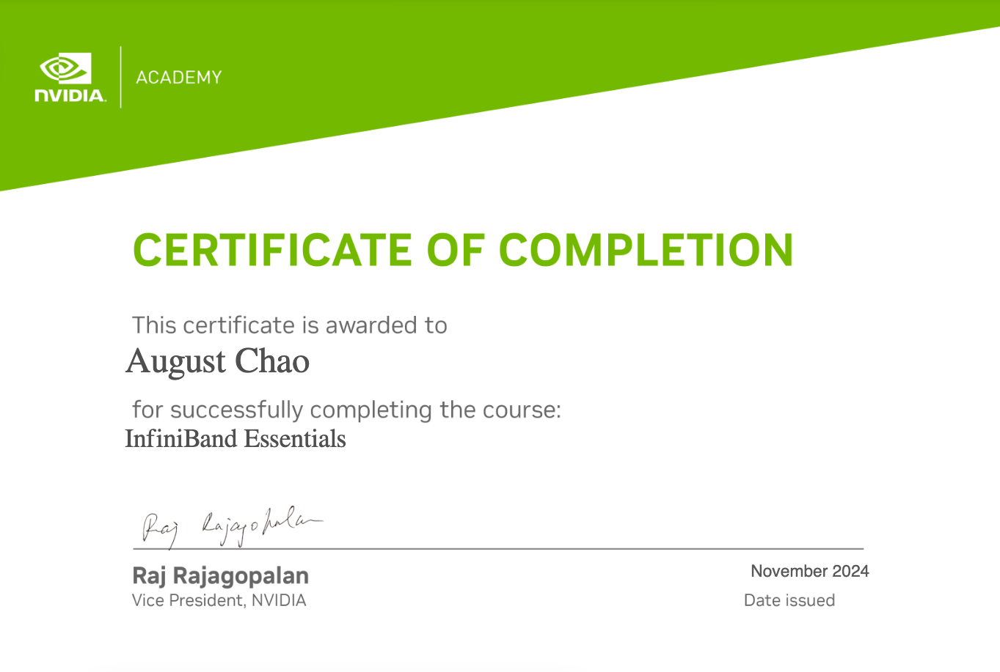

# Computer Skills

1. NVIDIA DLI-NLP 講師, 2019
2. 巨量資料分析師初級能力 B-B11-0036-2017
3. Planner of Business Intelligence: CERPS1510680 (2015)
4. Application Engineer of Property Management System in Front Office Module for WISE Web Hotel Manager V7.X 資訊系統應用師: CERPS1048398 (2014)
5. MSCS Big Data (2014)
6. HP ATA - Servers & Storage (2014)
7. CompTIA Security+: 7Z4QESTL9CBEKZHC
8. 

# Management

1. 財團法人光華管理策進基金會 個案高階講座師資認證 2015A024
2. Planner of Enterprise Resource Planning: CERPS1308032
3. IACVA-TW 無形資產鑑價師 師資班結業 (2014)
4. Planner of Property Management System 旅館資訊系統規劃師: CERPS1408565 (2014)
5. 觀光餐旅客戶關係管理師: TIEA-THCRMM-10200110
6. 觀光餐旅人力資源管理師: TIEA-THHRM-10200067
7. 觀光餐旅消費者行為管理師: TIEA-THCBM-10200086
8. Google AdWords:  廣告基礎考試, 進階搜尋, 多媒體廣告進階 2015-03

# Language

1. TOEIC 820 (B1), April 2008
2. 觀光餐旅專業英文管理師: TIEA-THPEM-10200215
